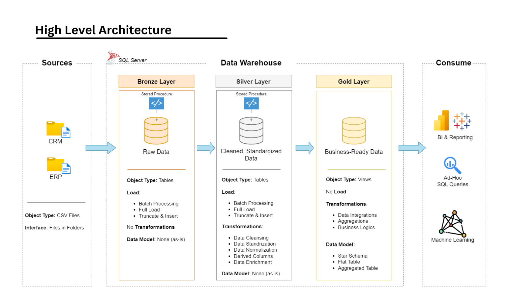
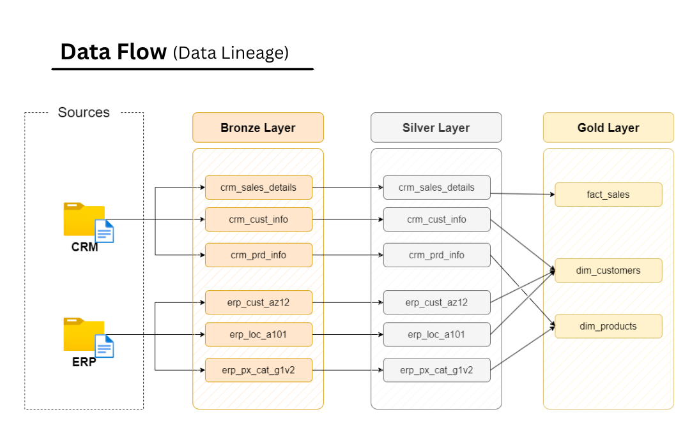
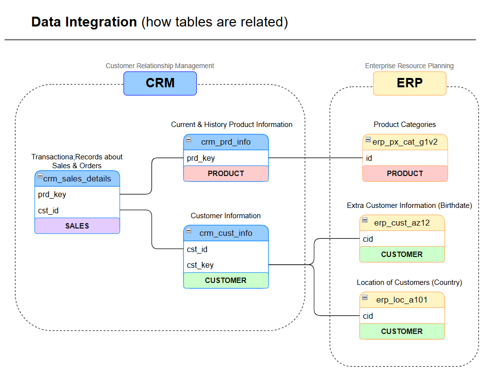
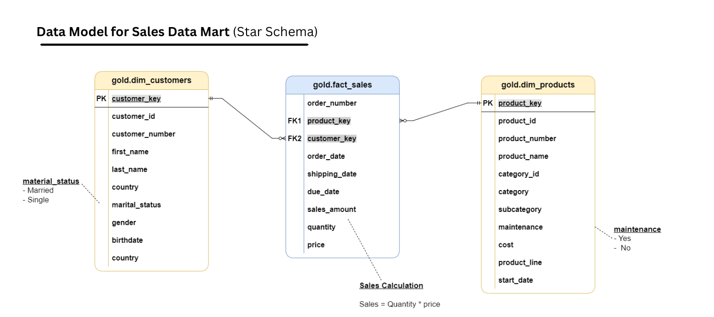

# Data Warehouse and Analytics Project

Welcome to the **Data Warehouse and Analytics Project** repository! ⚡  
This project showcases an end-to-end data warehousing and analytics solution — from building the warehouse itself to delivering meaningful business insights. I built this as a portfolio project to demonstrate practical data engineering and analytics skills aligned with industry standards.

---

## 📖 Project Overview

- **Data Architecture**: I designed a modern medallion data warehouse (Bronze → Silver → Gold) on SQL Server.
- **ETL Pipelines**: wrote stored procedures (`bronze.load_bronze`, `silver.load_silver`) to extract, transform, and load data across all layers — with built-in timing, logging, and error handling.
- **Data Modeling**: built a star schema in the Gold layer (`fact_sales`, `dim_customers`, `dim_products`) as SQL views joining enriched Silver tables.
- **Analytics & Reporting**: The Gold views are ready to plug into Power BI, Tableau, or ad-hoc SQL queries.

> 🎯 This is a portfolio project demonstrating my skills in SQL Server, T-SQL, data warehousing, and analytics engineering.

---

## 🏗️ Data Architecture

I designed the architecture following the **Medallion Architecture** pattern with three layers — Bronze, Silver, and Gold — all running on SQL Server:



1. **Bronze Layer**: Stores raw data as-is from the source systems. Data is ingested from CSV Files into SQL Server Database.
2. **Silver Layer**: This layer includes data cleansing, standardization, and normalization processes to prepare data for analysis.
3. **Gold Layer**: Houses business-ready data modeled into a star schema required for reporting and analytics.


---


## 🔄 Data Flow (Data Lineage)

Here's how data flows from the two source systems all the way to the Gold layer:



---

## 🔗 Data Integration

I integrated the two source systems — CRM and ERP — using shared business keys:



- **CRM** holds transactional sales records (`crm_sales_details`), customer info (`crm_cust_info`), and product details (`crm_prd_info`).
- **ERP** enriches customers with birthdate (`erp_cust_az12`) and country (`erp_loc_a101`), and adds product categories (`erp_px_cat_g1v2`).

Key joins I implemented in the Gold layer:
- `crm_cust_info` ← joined → `erp_cust_az12` and `erp_loc_a101` via `cst_key = cid`
- `crm_prd_info` ← joined → `erp_px_cat_g1v2` via extracted `cat_id`
- `crm_sales_details` ← joined → `dim_products` and `dim_customers` via surrogate keys

---

## 🥉 Bronze Layer

**Goal:** Land raw data from CSV files into SQL Server exactly as-is — no transformations, full traceability.

| Attribute | Details |
|-----------|---------|
| Object Type | Tables |
| Load Method | Full Load — Truncate & Insert |
| Transformations | None (as-is) |
| Target Audience | Data Engineers |

I created 6 tables (`crm_cust_info`, `crm_prd_info`, `crm_sales_details`, `erp_loc_a101`, `erp_cust_az12`, `erp_px_cat_g1v2`) and loaded them via `BULK INSERT` inside the `bronze.load_bronze` stored procedure. The procedure truncates each table before loading, logs timing per table, and catches errors cleanly:

```sql
EXEC bronze.load_bronze;
```

---

## 🥈 Silver Layer

**Goal:** Transform and clean Bronze data into a consistent, analysis-ready state.

| Attribute | Details |
|-----------|---------|
| Object Type | Tables |
| Load Method | Full Load — Truncate & Insert |
| Transformations | Cleaning, Standardization, Normalization, Derived Columns |
| Target Audience | Data Analysts, Data Engineers |

I applied the following transformations inside `silver.load_silver`:

- **Deduplication**: Used `ROW_NUMBER() OVER (PARTITION BY cst_id ORDER BY cst_create_date DESC)` to keep only the most recent customer record.
- **Standardization**: Expanded coded values — `'M'` → `'Married'`, `'F'` → `'Female'`, product line codes → full names.
- **Derived columns**: Extracted `cat_id` from the `prd_key` field using `SUBSTRING` and `REPLACE`.
- **Date fixes**: Converted integer-format dates (e.g. `20130101`) to proper `DATE` columns; nullified invalid values like `0` or wrong-length integers.
- **Sales recalculation**: Corrected `sls_sales` where it was null, zero, or inconsistent with `quantity × price`.
- **Key normalization**: Stripped `'NAS'` prefix from ERP customer IDs and removed hyphens from location IDs.
- **Null handling**: Future birthdates set to `NULL`; missing country codes mapped to `'n/a'`.

I also added a `dwh_create_date DATETIME2 DEFAULT GETDATE()` audit column to all Silver tables.

```sql
EXEC silver.load_silver;
```

---

## 🥇 Gold Layer

**Goal:** Expose business-ready, integrated data as SQL views in a star schema.

| Attribute | Details |
|-----------|---------|
| Object Type | Views |
| Load Method | None (computed on-the-fly from Silver) |
| Transformations | Integration, Surrogate Keys, Business Logic |
| Target Audience | Data Analysts, Business Users |

I built three Gold views in `ddl_gold.sql`:

- **`gold.dim_customers`** — joins `silver.crm_cust_info` with `silver.erp_loc_a101` and `silver.erp_cust_az12`; generates a surrogate `customer_key` via `ROW_NUMBER()`; CRM is the master source for gender, with ERP as fallback.
- **`gold.dim_products`** — joins `silver.crm_prd_info` with `silver.erp_px_cat_g1v2`; generates a surrogate `product_key`; filters out historical records (`WHERE prd_end_dt IS NULL`).
- **`gold.fact_sales`** — joins `silver.crm_sales_details` with `gold.dim_products` and `gold.dim_customers` to resolve surrogate keys.

---

## 🌟 Data Model — Sales Data Mart (Star Schema)




The central table, `gold.fact_sales`, contains sales transactions and quantitative metrics used for reporting and KPI analysis. It connects to descriptive dimensions such as customers and products through foreign keys.vThe dimension tables: `gold.dim_customers`, `gold.dim_products`  

The schema follows **one(mandatory)-to-many(optional) relationships**. This ensures:
- A given customer must exist in dim_customers table even though they did not make any orders.
- One customer can appear in many sales records. Same with products.


---

## 📊 What You Can Do with the Gold Layer

- Connect **Power BI** or **Tableau** directly to the Gold views for instant dashboards.
- Run **ad-hoc SQL** against `fact_sales`, `dim_customers`, and `dim_products`.
- Export as flat tables for **machine learning** feature engineering.


---

Big thanks and credits to Baraa Khatib Salkini ([DataWithBaraa.com](https://www.datawithbaraa.com/)). I followed his project workthrough.  
You can find the full course here: [link](https://youtube.com/playlist?list=PLNcg_FV9n7qZY_2eAtUzEUulNjTJREhQe&si=G-88-AkSjBYLzNGe)

---

## 🗂️ Repository Structure

```
data-warehouse-project/
│
├── datasets/                          # Raw source data (CSV files)
│   ├── source_crm/
│   │   ├── cust_info.csv
│   │   ├── prd_info.csv
│   │   └── sales_details.csv
│   └── source_erp/
│       ├── cust_az12.csv
│       ├── loc_a101.csv
│       └── px_cat_g1v2.csv
│
├── docs/                              # Architecture diagrams
│   ├── data_architecture.png
│   ├── data_flow.png
│   ├── data_integration.png
│   ├── data_model_golden_layer.png
│   └── data_layers.pdf
│
├── scripts/
│   ├── init_database.sql              # Creates DataWarehouse DB + schemas
│   ├── bronze/
│   │   ├── ddl_bronze.sql             # Bronze table definitions
│   │   └── proc_load_bronze.sql       # BULK INSERT stored procedure
│   ├── silver/
│   │   ├── ddl_silver.sql             # Silver table definitions
│   │   └── proc_load_silver.sql       # ETL stored procedure (Bronze → Silver)
│   └── gold/
│       └── ddl_gold.sql               # Gold views (Star Schema)
│
├── tests/                             # Data quality & validation checks
│
└── README.md
```

---
